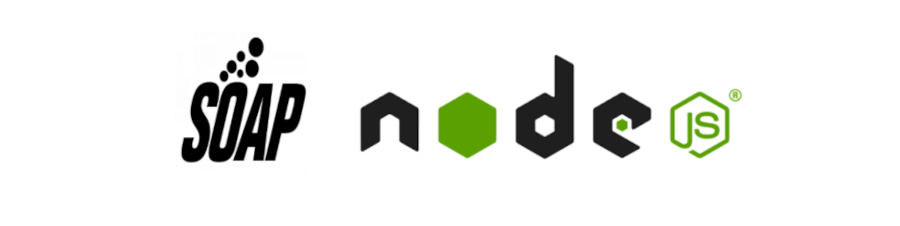
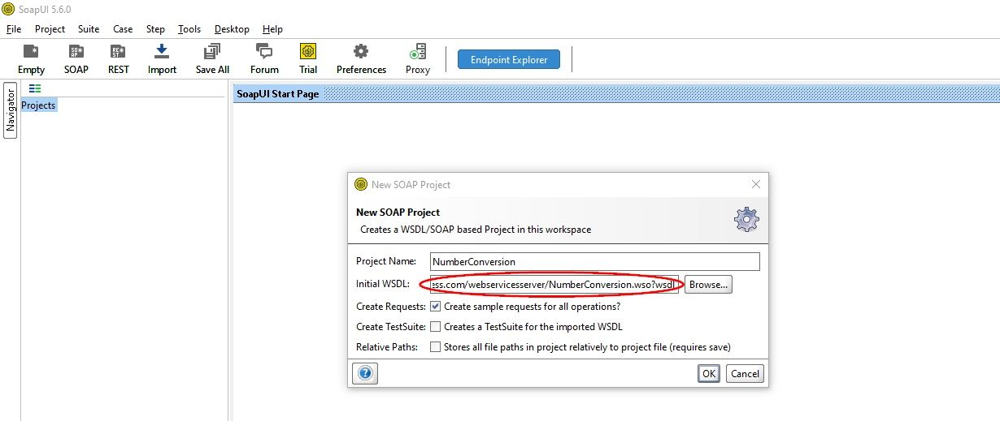
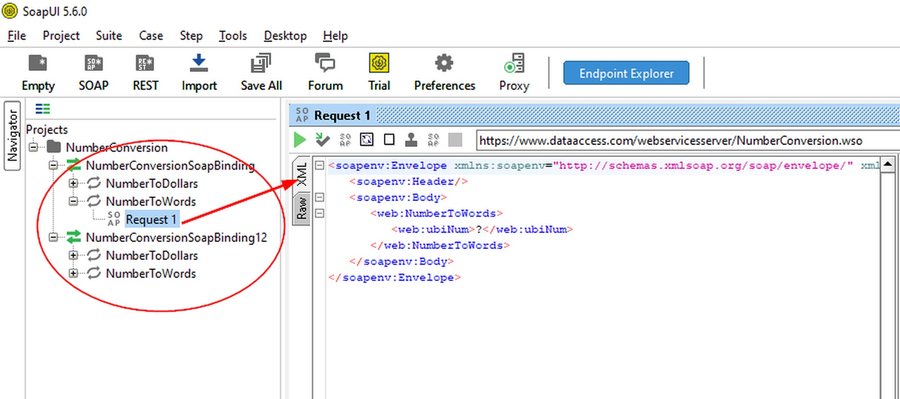
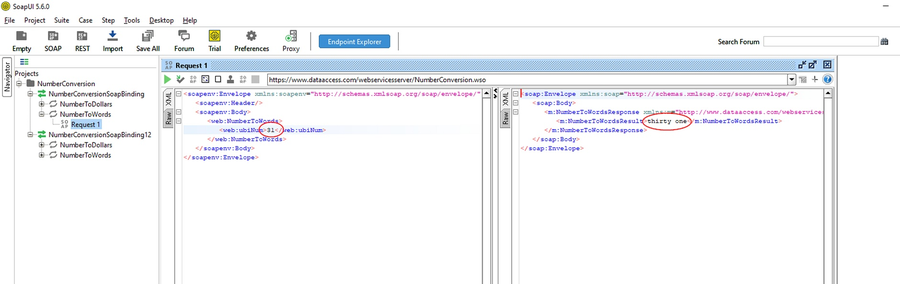
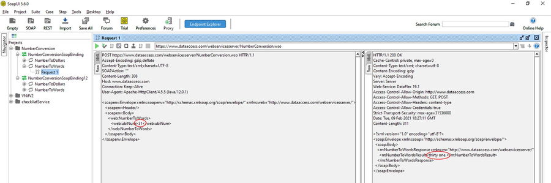

SOAP requests with Node.js 
==========================

 

 
 These days, when we think of interfaces that provide services to
clients and/or developers, we usually think of **REST**. But before there
was REST, there were other architectures such as **SOAP** and **XML-RPC**.


**SOAP** stands for **Simple Object Access Protocol**. It's an API based on
XML. And despite being in disuse, there may be occasions when you need
to consume a service that uses it. Where? Well, usually in business or
government environments that seem to be trapped in some kind of time
vortex.


A SOAP interface is defined using **WSDL (Web Services Description
Language)** which is an XML-based dialect. A WSDL document provides the
necessary information to the client to interact with the Web service. 
 
 

Here is an example:


```xml
<?xml version="1.0" encoding="UTF-8"?>
<schema xmlns="http://www.w3.org/2001/XMLSchema" 
xmlns:VNifV2Ent="http://www2.agenciatributaria.gob.es/static_files/common/internet/dep/aplicaciones/es/aeat/burt/jdit/ws/VNifV2Ent.xsd" 
targetNamespace= "http://www2.agenciatributaria.gob.es/static_files/common/internet/dep/aplicaciones/es/aeat/burt/jdit/ws/VNifV2Ent.xsd"
 elementFormDefault="qualified">
	<annotation>
		<documentation>
    		Esquema para solicitar la verificación de un NIF
    	</documentation>
	</annotation>
	<element name="VNifV2Ent" type="VNifV2Ent:VNifV2Ent"/>
	<complexType name="VNifV2Ent">
		<annotation>
			<documentation>
				NIF : NIF a verificar
				Nombre: Nombre o Razón Social
			</documentation>
		</annotation>
		<sequence>
			<element name="Contribuyente" minOccurs="1" maxOccurs="10000">
				<complexType>
					<sequence>
						<element name="Nif" type="string"/>
						<element name="Nombre" type="string"/>
					</sequence>
				</complexType>
			</element>
		</sequence>
	</complexType>
</schema>
```

 


 
 **How to consume a SOAP service?** 
-----------------------------------


 

To consume a **SOAP API**, we need to send it a POST request containing 2
things:

- The appropriate headers

- An XML format fragment called SOAP envelope


 

**The headers**


 

For almost all SOAP requests, it is necessary to send the data in XML
format. Therefore we will add...


 

`Content-Type: text/xml;charset=UTF-8`


 

We could also include a user-agent because some servers are very picky
about requests that don't have this header. For example:


 

`user-agent: "Mozilla/5.0 (Macintosh; Intel Mac OS X 10_7_3) AppleWebKit/535.19 (KHTML, como Gecko) Chrome/18.0.1025.151 Safari/535.19"`


 


 

**The SOAP Envelope**


 

The **SOAP envelope** defines the framework that determines what can be
entered into a message, who should enter it and whether that operation
is optional or mandatory. It can be considered the payload of the
service. We are going to use an open source tool called
[SoapUI](https://www.soapui.org/downloads/soapui/) to generate such
payloads.


 You can enter a WSDL in SOAPUI via local files (usually a group of
files with .wsdl and .xsd extension) or via a URL.
 
 
 **A first example**
 
 


 Of course the first thing we need is **a service to consume**. For example
the one we can find at
[https://www.dataaccess.com/webservicesserver/NumberConversion.wso?wsdl](https://www.dataaccess.com/webservicesserver/NumberConversion.wso?wsdl)
 
 This simple service allows us to transform numbers expressed in figures
into numbers expressed in words. That is to say, if we send it the
number 31, it will return the word thirty-one. 
 
 Let's do it through its URL. We open SOAPUI, create a new SOAP project
and enter its url:
 

[https://www.dataaccess.com/webservicesserver/NumberConversion.wso?wsdl](https://www.dataaccess.com/webservicesserver/NumberConversion.wso?wsdl)


 

 
 

 

Note that by default it will generate "SOAP Bindings" for all options
provided by the service.

 
 
 

 

These are standard XML schemas for the SOAP web service to consume. All
you have to do is fill in the data and replace the ? signs with
acceptable data for the service to consume. For example, the number 31.


 
 
 

Notice that on the left we have the request and on the right the
response. And if we explore both in their raw form we will see...


 
 
 


 


 


 


 


 


 


 


 

...the complete request with its headers and the response received.


 


 

**Testing the service with Postman** 
-----------------------------------

 


 

TODO


 

