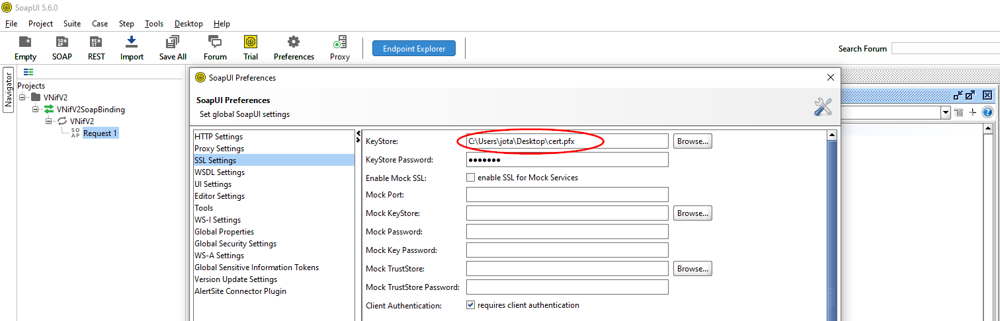

SOAP requests with Node.js 
==========================

 

 
 These days, when we think of interfaces that provide services to
clients and/or developers, we usually think of **REST**. But before there
was REST, there were other architectures such as **SOAP** and **XML-RPC**.


**SOAP** stands for **Simple Object Access Protocol**. It's an API based on
XML. And despite being in disuse, there may be occasions when you need
to consume a service that uses it. Where? Well, usually in business or
government environments that seem to be trapped in some kind of time
vortex.


A SOAP interface is defined using **WSDL (Web Services Description
Language)** which is an XML-based dialect. A WSDL document provides the
necessary information to the client to interact with the Web service. 
 
 

Here is an example:


```xml
<?xml version="1.0" encoding="UTF-8"?>
<schema xmlns="http://www.w3.org/2001/XMLSchema" 
xmlns:VNifV2Ent="http://www2.agenciatributaria.gob.es/static_files/common/internet/dep/aplicaciones/es/aeat/burt/jdit/ws/VNifV2Ent.xsd" 
targetNamespace= "http://www2.agenciatributaria.gob.es/static_files/common/internet/dep/aplicaciones/es/aeat/burt/jdit/ws/VNifV2Ent.xsd"
 elementFormDefault="qualified">
	<annotation>
		<documentation>
    		Esquema para solicitar la verificación de un NIF
    	</documentation>
	</annotation>
	<element name="VNifV2Ent" type="VNifV2Ent:VNifV2Ent"/>
	<complexType name="VNifV2Ent">
		<annotation>
			<documentation>
				NIF : NIF a verificar
				Nombre: Nombre o Razón Social
			</documentation>
		</annotation>
		<sequence>
			<element name="Contribuyente" minOccurs="1" maxOccurs="10000">
				<complexType>
					<sequence>
						<element name="Nif" type="string"/>
						<element name="Nombre" type="string"/>
					</sequence>
				</complexType>
			</element>
		</sequence>
	</complexType>
</schema>
```

 
 ---


 
 **How to consume a SOAP service?** 
-----------------------------------


 

To consume a **SOAP API**, we need to send it a POST request containing 2
things:

- The appropriate headers

- An XML format fragment called SOAP envelope


**The headers**


 

For almost all SOAP requests, it is necessary to send the data in XML
format. Therefore we will add...


 

`Content-Type: text/xml;charset=UTF-8`


 

We could also include a user-agent because some servers are very picky
about requests that don't have this header. For example:


 

`user-agent: "Mozilla/5.0 (Macintosh; Intel Mac OS X 10_7_3) AppleWebKit/535.19 (KHTML, como Gecko) Chrome/18.0.1025.151 Safari/535.19"`

 
 

**The SOAP Envelope**


 

The **SOAP envelope** defines the framework that determines what can be
entered into a message, who should enter it and whether that operation
is optional or mandatory. It can be considered the payload of the
service. We are going to use an open source tool called
[SoapUI](https://www.soapui.org/downloads/soapui/) to generate such
payloads.


 You can enter a WSDL in SOAPUI via local files (usually a group of
files with .wsdl and .xsd extension) or via a URL.
 
 ---
 &nbsp;&nbsp;

 
 **A first example**
 -------------------

 &nbsp;&nbsp;
 


 Of course the first thing we need is **a service to consume**. For example
the one we can find at
[https://www.dataaccess.com/webservicesserver/NumberConversion.wso?wsdl](https://www.dataaccess.com/webservicesserver/NumberConversion.wso?wsdl)
 
 This simple service allows us to transform numbers expressed in figures
into numbers expressed in words. That is to say, if we send it the
number 31, it will return the word thirty-one. 
 
 Let's do it through its URL. We open SOAPUI, create a new SOAP project
and enter its url:
 

[https://www.dataaccess.com/webservicesserver/NumberConversion.wso?wsdl](https://www.dataaccess.com/webservicesserver/NumberConversion.wso?wsdl)


 

 
 
&nbsp;&nbsp;
 

Note that by default it will generate "SOAP Bindings" for all options
provided by the service.

&nbsp;&nbsp;

 
 
 

 
&nbsp;&nbsp;

These are standard XML schemas for the SOAP web service to consume. All
you have to do is fill in the data and replace the ? signs with
acceptable data for the service to consume. For example, the number 31.

&nbsp;&nbsp;

 
 
 
&nbsp;&nbsp;

Notice that on the left we have the request and on the right the
response. And if we explore both in their raw form we will see...

&nbsp;&nbsp;

 
 
 
 
 
&nbsp;&nbsp;

...the complete request with its headers and the response received.


 
---

&nbsp;&nbsp;
 

**Consuming SOAP using Node**
-----------------------------
 
&nbsp;&nbsp;
 
It is true that there are modules to consume SOAP from Node, but in an attempt to better understand how it works and given that all you have to send is a few headers and a payload we are going to create a module that will do it without any middlemen. We will call this file soaprequest.js and it will contain...

```javascript
const axios = require('axios-https-proxy-fix');
module.exports = function soapRequest(opts = {
  url: '',
  headers: {},
  xml: '',
  timeout: 10000,
  proxy: false,
}) {
  const {
    url,
    headers,
    xml,
    timeout,
    proxy,
  } = opts;
  return new Promise((resolve, reject) => {
    axios({
      method: 'post',
      url,
      headers,
      data: xml,
      timeout,
      proxy,
    }).then((response) => {
      resolve({
        response: {
          headers: response.headers,
          body: response.data,
          statusCode: response.status,
        },
      });
    }).catch((e) => {
      if (e.response) {
        console.error(`${e}`);
        reject(e.response.data);
      } else {
        console.error(`${e}`);
        reject(e);
      }
    });
  });
};
```

We need the envelope of the NumberToWords soapAction that we obtained in the previous section using SoapUI and we are going to paste it in a file. We will call the file numbertoworld.xml and its content is:

```xml
<soapenv:Envelope xmlns:soapenv="http://schemas.xmlsoap.org/soap/envelope/" xmlns:web="http://www.dataaccess.com/webservicesserver/">
   <soapenv:Header/>
   <soapenv:Body>
      <web:NumberToWords>
         <web:ubiNum>31</web:ubiNum>
      </web:NumberToWords>
   </soapenv:Body>
</soapenv:Envelope>
```

Now to use it with the previous example we create the index.js file with the following content...

```javascript
const soapRequest = require('./soaprequest');
const fs = require('fs');

// example data
const url = 'https://www.dataaccess.com/webservicesserver/NumberConversion.wso';
const headersToAdd = {
  'user-agent': '',
  'Content-Type': 'text/xml;charset=UTF-8',
  'soapAction': '',
};
const xml = fs.readFileSync('numbertoworld.xml', 'utf-8');

// usage of module
(async () => {
  const { response } = await soapRequest({ url: url, headers: headersToAdd, xml: xml, timeout: 1000 }); // Optional timeout parameter(milliseconds)
  const { headers, body, statusCode } = response;
  console.log(headers);
  console.log(body);
  console.log(statusCode);
})();
```

We must not forget to install the module: 

```bash
$ npm i axios-https-proxy-fix
```
And if we run the script:

```bash
$ node index.js
```

We will have the answer to our request:

```javascript
{
  'cache-control': 'private, max-age=0',
  'content-length': '343',
  'content-type': 'text/xml; charset=utf-8',
  server: 'Server',
  'web-service': 'DataFlex 19.1',
  'access-control-allow-origin': 'http://www.dataaccess.com',
  'access-control-allow-methods': 'GET, POST',
  'access-control-allow-headers': 'content-type',
  'access-control-allow-credentials': 'true',
  'strict-transport-security': 'max-age=31536000',
  date: 'Fri, 26 Feb 2021 19:54:50 GMT',
  connection: 'close'
}
<?xml version="1.0" encoding="utf-8"?>
<soap:Envelope xmlns:soap="http://schemas.xmlsoap.org/soap/envelope/">
  <soap:Body>
    <m:NumberToWordsResponse xmlns:m="http://www.dataaccess.com/webservicesserver/">
      <m:NumberToWordsResult>thirty one </m:NumberToWordsResult>
    </m:NumberToWordsResponse>
  </soap:Body>
</soap:Envelope>
200
```
 
**Consuming SOAP requiring certificates using Node**
----------------------------------------------------


Let's say we need to consume a SOAP service that requests a **digital certificate**, for example to check a NIF number of the Spanish Tax Agency (Agencia Estatal de Administración Tributaria).

The SOAP service can be found at: https://www2.agenciatributaria.gob.es/static_files/common/internet/dep/aplicaciones/es/aeat/burt/jdit/ws/VNifV2.wsdl

If we add the URL to SoapUI we will see:
&nbsp;&nbsp;

 
&nbsp;&nbsp;

 Now we add the certificate along with its password with which it was exported to SoapUI in File → Preferences → SSL Settings. 
&nbsp;&nbsp;

 
&nbsp;&nbsp;

 If we modify the data of the request including a NIF number (in this example we are using the one of the company Iberdrola) and its valid user and we send it to the service...
&nbsp;&nbsp;

  
&nbsp;&nbsp;

  ...we get the response from the SOAP service. Observe now the **raw request** that is made and from which we can extract the envelope:
&nbsp;&nbsp;

  
&nbsp;&nbsp;

  Let's do it now using Node. For this we create the *index_certificate.js* file using the URL, NIF data and envelope we have obtained from SoapUI:

  ```javascript
  "use strict";
const soapRequest = require('./soaprequest');
const url = 'https://www1.agenciatributaria.gob.es/wlpl/BURT-JDIT/ws/VNifV2SOAP';
const headersToAdd = {
  'user-agent': '',
  'Content-Type': 'text/xml;charset=UTF-8',
  'soapAction': '',
};
const nif = 'A95758389';
const name= 'Iberdrola';

async function verifyNif(nif, name) { 
const xml = `<soapenv:Envelope xmlns:soapenv="http://schemas.xmlsoap.org/soap/envelope/" xmlns:vnif="http://www2.agenciatributaria.gob.es/static_files/common/internet/dep/aplicaciones/es/aeat/burt/jdit/ws/VNifV2Ent.xsd">
   <soapenv:Header/>
   <soapenv:Body>
      <vnif:VNifV2Ent>
         <!--1 to 20000 repetitions:-->
         <vnif:Contribuyente>
            <vnif:Nif>${nif}</vnif:Nif>
            <vnif:Nombre>${name}</vnif:Nombre>
         </vnif:Contribuyente>
      </vnif:VNifV2Ent>
   </soapenv:Body>
   </soapenv:Envelope>`;
    const { response } = await soapRequest({ url: url, headers: headersToAdd, xml: xml, timeout: 2000 });
    const { headers, body, statusCode } = response;
    console.log(body);
}

verifyNif(nif, name); 
```

We slightly modify the *soaprequest.js* file to include an **agent object** containing the certificate (do not forget to include it in the folder):

```javascript
"use strict";

const axios = require('axios-https-proxy-fix');
const https = require('https');
const fs = require('fs');

module.exports = function soapRequest(opts = {
  url: '',
  headers: {},
  xml: '',
  timeout: 10000,
  proxy: false
}) {
  const { url, headers, xml, timeout, proxy} = opts;
  return new Promise((resolve, reject) => {
    axios({
      method: 'post',
      url,
      headers,
      data: xml,
      timeout,
      proxy,
      httpsAgent: new https.Agent({
        pfx: fs.readFileSync('cert.pfx'),
        passphrase: '1234567'
      })
    }).then((response) => {
      resolve({
        response: {
          headers: response.headers,
          body: response.data,
          statusCode: response.status,
        },
      });
    }).catch((error) => {
      if (error.response) {
        console.error(`SOAP FAIL: ${error}`);
        reject(error.response.data);
      } else {
        console.error(`SOAP FAIL: ${error}`);
        reject(error);
      }
    });
  });
};
```

And the result...

```bash
<?xml version="1.0" encoding="UTF-8"?><env:Envelope xmlns:env="http://schemas.xmlsoap.org/soap/envelope/" xmlns:xsd="http://www.w3.org/2001/XMLSchema" xmlns:xsi="http://www.w3.org/2001/XMLSchema-instance"><env:Body><VNifV2Sal:VNifV2Sal xmlns:VNifV2Sal="http://www2.agenciatributaria.gob.es/static_files/common/internet/dep/aplicaciones/es/aeat/burt/jdit/ws/VNifV2Sal.xsd"><VNifV2Sal:Contribuyente><VNifV2Sal:Nif>A95758389</VNifV2Sal:Nif><VNifV2Sal:Nombre>IBERDROLA CLIENTES SA</VNifV2Sal:Nombre><VNifV2Sal:Resultado>IDENTIFICADO</VNifV2Sal:Resultado></VNifV2Sal:Contribuyente></VNifV2Sal:VNifV2Sal></env:Body></env:Envelope>
```